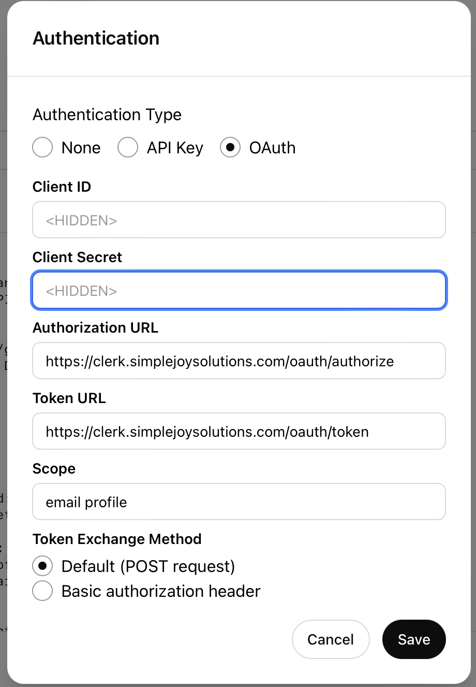

# custom-gpt-api-oauth

## Description 
Example OpenAI Custom GPT with user authentication and ability to read and write from a database.  

Database: Prisma with Neon Serverless Postgres
Authentication: Clerk OAuth 2 server

### Other goal: Inexpensive 
Neon and Vercel have generous free tiers. 
ChatGPT plus subscription is required for creating custom GPTs.
Custom Domain Name.  I like to purchase domains from Hover.com because I don't mind paying a bit extra in order to have a simple interface and not be bombarded with ads.

## Prisma
`npx prisma generate` - this will generate the Prisma client
`npx prisma db push` - this effectively runs migrations on the Neon serverless postgres database
`npx prisma format` - this will help define foreign keys and enforce best practices
`prisma migrate dev --name {name}` - this will create a migration file in the migrations folder.  You can use this to create a migration file.  The name is the name of the migration file.  The name should be in snake-case.
`prisma migrate deploy` - this will run the migrations


What I am loving about Prisma is being able to generate the Types, restart my Typescript server, and boom, I have the types for free.  I can also use Prisma Studio to visually see the database schema and relationships.  It's a great tool for development.

### How to use Prisma Studio
`npx prisma studio` - this will open the Prisma Studio in your browser.  You can use this to visually see the database schema and relationships.


## Getting Started

`pnpm install`

## Generate Open API Specs

Use the ActionsGPT created by OpenAI to create the Open API spec.
https://chatgpt.com/g/g-TYEliDU6A-actionsgpt

Here is the prompt:

Create an Open API spec based on the Prisma Schema and code snippet below.  OAuth2 is used for authentication.  The scopes are “profile”, "email".  The spec should be in YAML format.
Prisma schema:
```
{YOUR PRISMA SCHEMA HERE}
```
code snippet:
```typescript
{YOUR CODE HERE}
```

After it generates the spec, update the server URL, authorizationUrl, and tokenURL.


## Deploy to Vercel
The project is setup to deploy to Vercel without any changes.  
Note, Vercel automatically turns everything in the /api folder into serverless functions

## Deploy as a conventional Nodejs server
add a build script to package.json (`"build": "tsc"`).  Then you can use the dist folder as the root folder for your server.  


## Next Steps for Turning this into a real API
* Add more endpoints
* Add more tests
* Add more error handling
* Organize the API endpoints into files and folders
    * Guide on a more Vercel friendly way to organize the API endpoints into files and folders
        * https://www.prisma.io/blog/how-to-build-a-node-js-api-with-prisma-2-and-postgres-part-1-setting-up-the-development-environment-and-creating-the-database-schema   
    * Guide on a more standard Express structure
        src/
        │
        ├── controllers/       # Functions to handle requests
        │   ├── storeController.ts
        │   ├── productController.ts
        │   └── userController.ts
        ├── routes/            # Route definitions
        │   ├── storeRoutes.ts
        │   ├── productRoutes.ts
        │   └── userRoutes.ts
        │
        └── api/
            └── index.ts  
* Automatically generate Open API specs
    * consider using TSOA: https://tsoa-community.github.io/docs/getting-started.html


## Clerk
* Setup a new clerk project
* Assign a custom production domain
* Create a [Clerk Oauth2 Provider](https://clerk.com/docs/advanced-usage/clerk-idp)
    * leave the callbackURL incorrect for now, we will update it later
    * update the client secret and name
```
curl -X POST https://api.clerk.com/v1/oauth_applications \
 -H "Authorization: Bearer <CLERK_SECRET_KEY>"  \
 -H "Content-Type: application/json" \
 -d '{"callback_url":"https://oauth-client.com/oauth2/callback", "name": "oauth_app_1", "scopes": "profile email"}'
```
* Take the response from clerk and use it to update the authentication in the custom GPT Action

* Take the Open API schema generated above, update the server addrss, and authentication endpoints, then paste it into the schema for the Action
* wait for the draft to save successfully
* refresh and you should now see the Callback URL
* Copy the Callback URL and update the Clerk Oauth2 server
```
curl -X PATCH https://api.clerk.com/v1/oauth_applications/<oauth_application_id> \
 -H "Authorization: Bearer <CLERK_SECRET_KEY>"  \
 -H "Content-Type: application/json" \
 -d '{"callback_url":"https://oauth-client.com/oauth2/callback"}'
```

Verify with:
```
curl -X GET https://api.clerk.com/v1/oauth_applications \
 -H "Authorization: Bearer <CLERK_SECRET_KEY>"
```

# Publishing a GPT
## ChatGPT Domain Verification
In order to publish a GPT, you need to complete your Builder Profile including verifying your domain name.
More info: https://help.openai.com/en/articles/8798878-building-and-publishing-a-gpt

## Privacy Policy
Before publishing a GPT, you will need to create a privacy policy.  If you don't have one, here is a prompt template:
```
Help me create a simple privacy policy to publish on my website for my custom GPT.  My company name is [company name] and my website is [website url].  The company will collect email addresses, but it will never sell this information to third parties.
Ask me any questions you need to improve the privacy policy.
```


## FAQ
* `vercel dev` is not working as expected.
    run `pnpm dev`.  For some reason it tries to call app.listen() a second time despite the fact that it does not do this in production.
* When deploying to vercel, there are type build errors related to Prisma.  
    They are ignorable.  